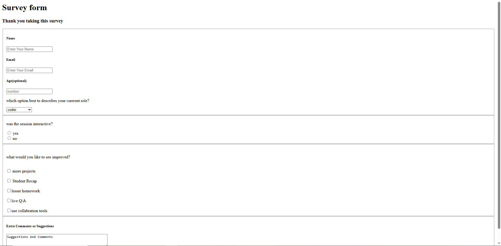
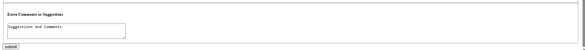

---

# Survey Form Project

## 📌 Overview

This project is a basic HTML survey form designed to collect user feedback about a session. It includes different input types such as text fields, email, number input, radio buttons, checkboxes, a dropdown menu, and a comment section.

## 🛠️ Technologies Used



[link](https://elbineldhose007.github.io/the-survey-form/)
* HTML5

## 📋 Features

* **Name Input** – Text field for entering user name
* **Email Input** – Email validation field
* **Age Input (Optional)** – Number input field
* **Role Selection** – Dropdown menu with options:

  * Coder
  * Web Designer
  * Animator
  * VFX
* **Session Feedback** – Radio buttons (Yes/No)
* **Improvement Suggestions** – Multiple checkboxes:

  * More projects
  * Student Recap
  * Lesser homework
  * Live Q&A
  * Use collaboration tools
* **Additional Comments** – Textarea for extra suggestions
* **Submit Button**

## 📂 File Structure

```
project-folder/
│
└── index.html
```

## ▶️ How to Run

1. Download or clone the project.
2. Open the `index.html` file in any web browser.
3. Fill out the survey form and submit.

## ⚠️ Notes / Improvements

* Add `name` attributes to checkbox inputs for better form handling.
* Wrap the entire form inside one `<form>` tag instead of multiple forms.
* Add `required` attributes for mandatory fields.
* Improve formatting using CSS.
* Connect the form to a backend (PHP, Node.js, etc.) for data submission.

## 🎯 Purpose

This project is ideal for beginners learning HTML forms and input elements.

---


